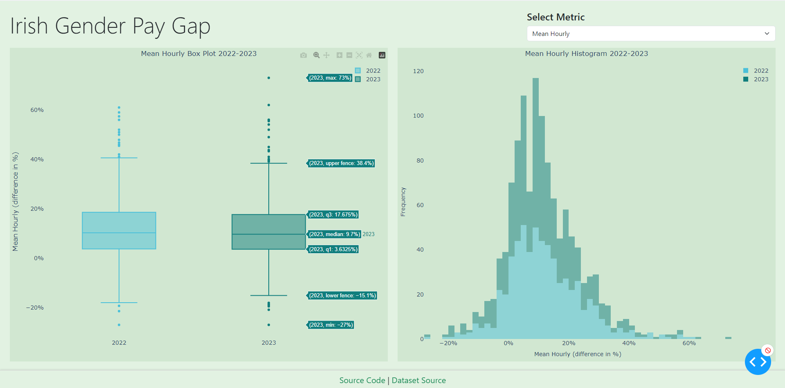

## Overview
Dash application for visualizes gender pay gap statistics using data from the Irish Gender Pay Gap Dataset. It allows users to filter and view various metrics through interactive plots.



## Features
- Dynamic Filtering: Select different metrics to view in the plots.
- Interactive Plots: View box plots and histograms that update based on the selected metric.
- Responsive Design: The app layout adjusts for different screen sizes.

## Installation
Clone the repository:
```bash
git clone https://github.com/Alfredomg7/irish-gender-pay-gap-dashboard.git
cd irish-gender-pay-gap-dashboard
```
Install the required packages:
```bash
pip install -r requirements.txt
```

## Usage
Download the CSV file from https://github.com/zenbuffy/irishGenderPayGap named as 'gpg.csv'.

Run the application:
```bash
python app.py
```
Open your browser and navigate to http://127.0.0.1:8050 to interact with the dashboard.

## Components
- Data Loading: The application loads data from gpg.csv.
- Column Formatting: The columns are formatted for better readability.
- Select Component: A dropdown allows users to select metrics for filtering.
- Plot Containers: Plots are displayed in responsive containers.
- Layout: The layout includes a header, plots, and a footer with links.

## Code Explanation
- Data Handling: Data is read from gpg.csv and formatted using the format_columns function.
- Dash Components: The layout is constructed with Dash, dash_bootstrap_components, and plotly.graph_objects.
- Callbacks: Update the plots based on the selected metric using the update_charts callback function.

## Links
- [Dataset Source](https://github.com/zenbuffy/irishGenderPayGap)

